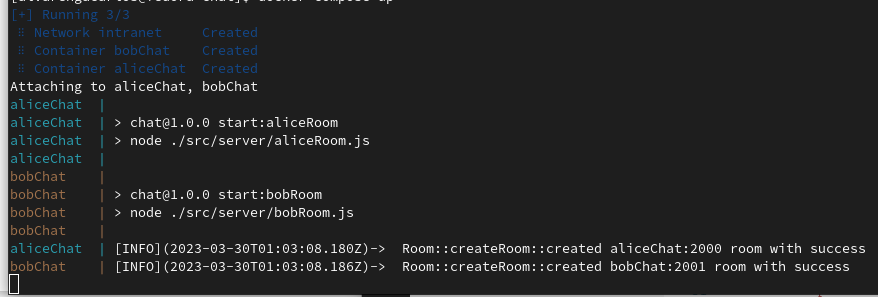
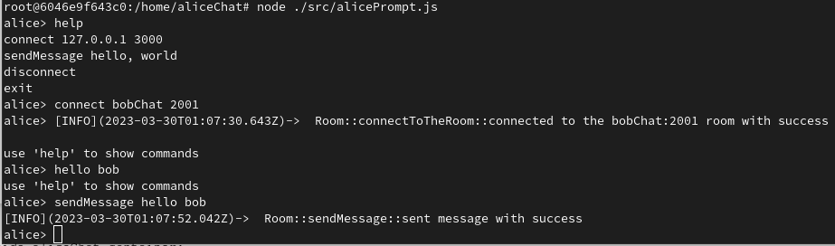
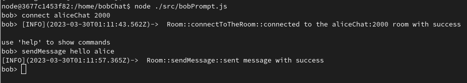
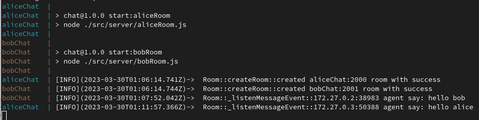

# __Chat__
It is a simple implementation of the UDP protocol where it is possible make a communication between users of the same network.

## __How it work__
### __Description__
Using UDP protocol the users create a server and a agent. So, they can send messages between them.

### __Images__





## __Run Chat application__
### __Quick start__
- Initialize containers with this command:
```bash
#The messages will be logged here.
docker compose up
```

>__To Alice:__
```bash
docker container exec -it -u node aliceChat bash
```

- Inside aliceChat container:
```bash
node ./src/alicePrompt.js
```

- You can get help with this command:
```bash
alice> help
```

- Connect to bobChat container:
```bash
alice> connect bobChat 2001
```

- Send a message to bob:
```bash
alice> sendMessage hello bob
```

>__To Bob:__
```bash
docker container exec -it -u node bobChat bash
```

- Inside aliceChat container:
```bash
node ./src/bobPrompt.js
```

- Connect to aliceChat container:
```bash
bob> connect aliceChat 2000
```

- Reply alice:
```bash
bob> sendMessage hello alice
```

## __Development__
### __Quick start__
- Initialize chat container with this command:
```bash
#You can also change the aliceChat to bobChat
docker compose run --rm --service-ports -u node aliceChat bash
```